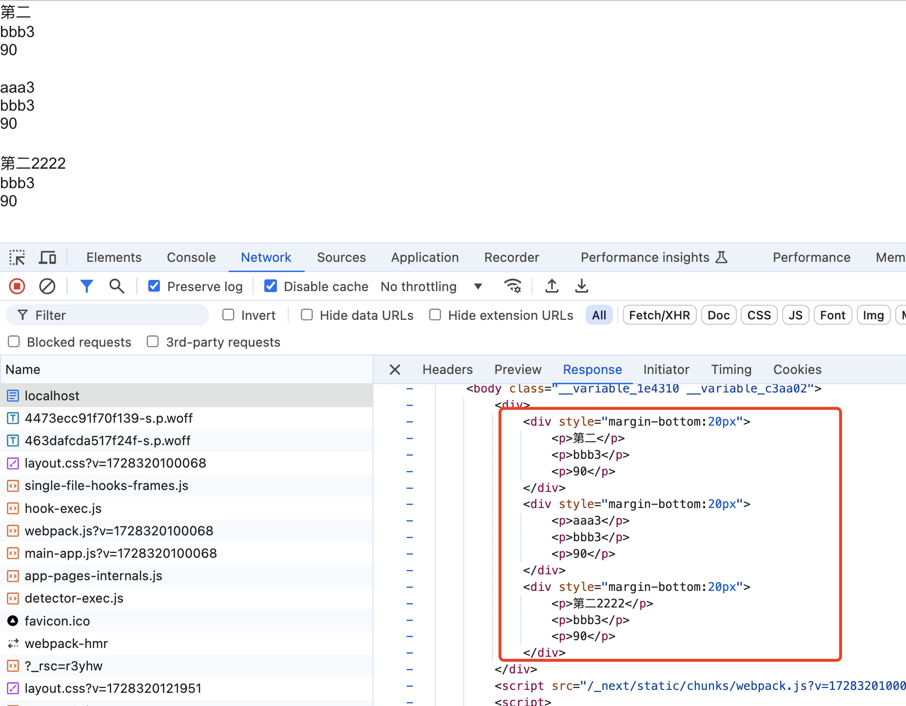

# Next.js 实战

看文档快速入门Next.js，写这个例子来验证自己的学习成果，同时复盘一个Node.js，太久没写了...

项目构思很简单，采用前后端分离架构，就是一个图书管理系统，普通用户或没登陆只能查看图书，而管理员可能对图书进行CRUD操作。

首先从数据库设计来说就两个表，分别是用户表（users）和图书表（books），图片表（images）
在这里采用数据库排老三的SQLite3单文件数据库来存储所有数据。

## 运行项目

优先启动 server api 再启动 client 客户端。

### 启动 server (已完成)

```bash
cd server          # cd 到服务接口项目
npm install        # 安装依赖
sqlite3 db.sqlite  # 创建sqlite3数据库
.read ./db.sql     # 执行sql生成表
.q                 # 退出sqlite3
npm run dev        # 启动服务
```

### 启动 client (看文档开发中ing)

```bash
cd client
npm install
npm run dev
```
 

## Next.js 笔记

Next.js 组件和路由组件默认是 Server Component（服务组件），如果要使用 客户端组件需要在组件顶部加上`"use client"`指令.

服务端组件默认在服务器上渲染一次，客户端组件在服务器渲染一次，然后在客户端在渲染一次。

客户端组件渲染2次，是Next.js为了体验做了优化，在服务端渲染一下生成HTML返回，不至于已经来就是空白。 


如何快速开发一个服务端组件，并且请求数据呢？加载页面是返回的是HTML结构。

感觉开发一个SSR页面很简单~

```ts
async function getBooks() {
  const res = await fetch("http://localhost:8901/v1/books")
  if (!res.ok) {
    throw new Error("请求数据失败")
  }

  return res.json()
}

// 返回HTML结构，实现服务端渲染数据
export default async function Home() {
  const { data } = await getBooks()
  return (
    <div>
      {
        data.map((item: any)=>(
          <div key={item.id} style={{marginBottom: 20}}>
            <p>{item.title}</p>
            <p>{item.author}</p>
            <p>{item.price}</p>
          </div>
        ))
      }
    </div>
  );
}
```

!(快速上手)[]

## 数据库设计

为了简单，不过多设计字段

用户表（users）

- id
- email
- username
- password
- avatar
- role
- created_at
- updated_at

图书表（books）

- id
- title
- author
- price
- cover_pic
- description
- created_at
- updated_at

图片表（images）

- id
- filename
- data


### 使用SQL建表 

```bash
# 快速搭建项目目录
mkdir server && cd server
touch db.sql

# 编写完sql后执行以下

# 创建 db.sqlite
sqlite3 db.sqlite

# 随意执行一个命令，生成db.sqlite文件
.table 

# 执行sql创建表
.read ./db.sql

# 检查验证
.table
.index

# 更多sqlite3命令查询帮助
.help

```


## 搭建server端

上面已经创建了server目录，现在开始构建 Node + TypeScript 开发服务端环境。

首先nvm切换到一个比较新的node版本，我这里是使用的是v20.14.0版本。

```bash
# 初始化package.json包
npm init -y

# 安装基础依赖，nodemon 用于热重载，使用ts-node来解析ts文件，@types/node是node类型定义。
npm i -D typescript nodemon ts-node @types/node

# 初始化 tsconfig.json 配置
npx tsc --init
```

### 修改 tsconfig.json 配置

```json
{
  "compilerOptions": {
    "module": "NodeNext",
    "moduleResolution": "NodeNext",
    "target": "ES2020",
    "sourceMap": true,
    "outDir": "dist",
    "resolveJsonModule": true
  },
  "include": [
    "src/**/*"
  ],
}
```


### 修改 package.json

```json
"type": "module", -- 使用es6模块，import export 导入导出；而不是CommonJS
"scripts": {
    "start": "nodemon ./src/index.ts",
    "build": "tsc"
},
```

### 创建入口文件并测试效果

- mkdir src
- touch src/index.ts

index.ts 写入代码
```ts
type User = {
    id: number;
    username: string;
}

const user: User = {
    id: 1,
    username: "zhangsan"
}

console.log(user)
```

执行 `npm run build` 没有问题，可以生成dist目录，里面的index.js也是正常的，
但是执行 `npm run dev` 会报以下错误：
`TypeError: Unknown file extension ".ts" for xxxx  code: 'ERR_UNKNOWN_FILE_EXTENSION'`

一番查询，得知这个应该是Node版本问题，看下面的 issues
https://github.com/TypeStrong/ts-node/issues/1997

- 最终解决这个问题的方式是这样的

`"dev": "nodemon --watch src --exec node --no-warnings=ExperimentalWarning --loader ts-node/esm ./src/index.ts"`

修改命令之后，重新执行 `npm run dev` 启动，一切正常，修改index.ts也会重新输出，nice。

- 小记：现在好像比较推荐的是使用tsx工具，而不是ts-node，但是npm上，ts-node下载量是千万级别，而tsx是百万级别。这对我或这个项目来说影响不大。


## 使用Express创建api

安装node开发常用npm package，不作多都解析：

- dotenv 加载.env文件环境变量
- cors 解决跨域问题
- bcryptjs 加密密码
- cookie-parser cookie 解析
- jsonwebtoken jwt token

```bash
npm i express dotenv cors bcryptjs cookie-parser jsonwebtoken
```

当然一般都需要安装ts对应的类型，这个根据代码提示安装即可，例如：`npm i --save-dev @types/express`


### 使用 better-sqlite3 操作数据库

better-sqlite3 是同步的api，查询速度更快，支持事物... 看文档

- 安装 `npm i better-sqlite3`
- 查看 [文档](https://github.com/WiseLibs/better-sqlite3/tree/master/docs)
- 查看 [Api](https://github.com/WiseLibs/better-sqlite3/blob/master/docs/api.md)

